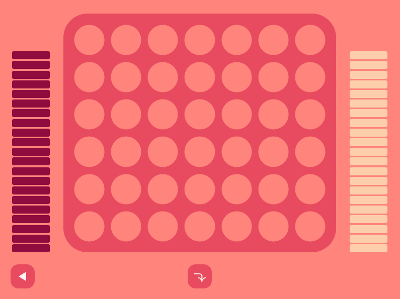

# four-dots

A Connect Four clone. I built this to experiment with [Tauri](https://tauri.app/). The UI is written in [Svelte](https://svelte.dev/), and the backend in Rust.

Downloadable .exe on itch.io: https://okayscott.itch.io/four-dots




## Running in Development

Run these commands in separate shells
```bash
yarn run dev
```
```bash
yarn tauri dev
```

## Building

```bash
yarn build
```
